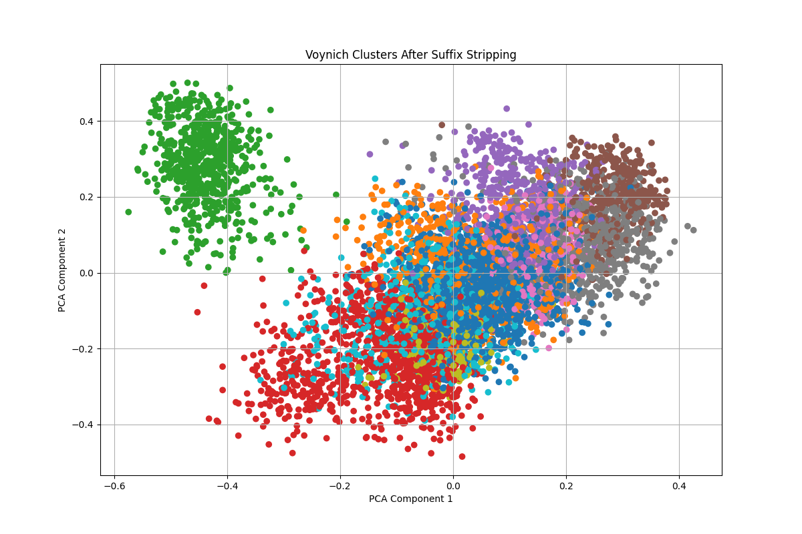
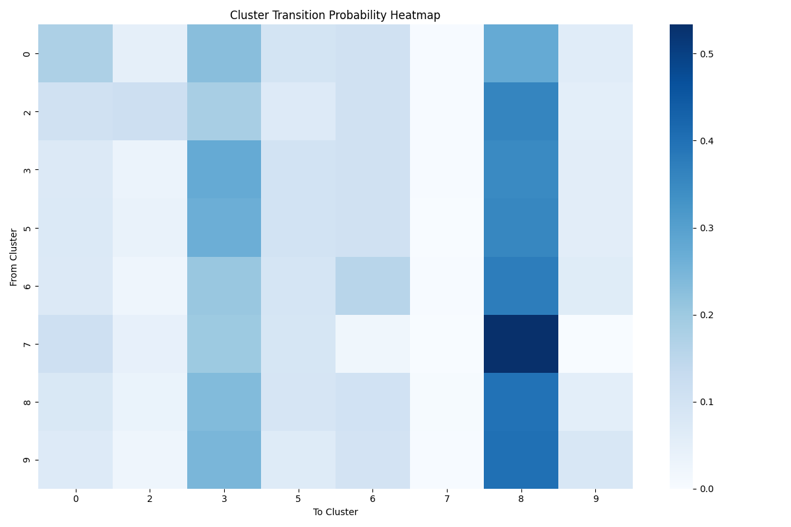

 Voynich Manuscript Structural Analysis

📜 Voynich Manuscript Structural Analysis
=========================================

🔍 Overview
-----------

This project explores the underlying structure of the Voynich Manuscript using modern natural language processing techniques. By analyzing transliterated word forms (likely EVA format), we apply clustering, POS inference, and syntactic modeling to test whether the manuscript behaves like a real language — even without deciphering glyph meanings.

* * *

🧠 Why This Matters
-------------------

The Voynich Manuscript remains undeciphered, with no agreed linguistic or cryptographic solution. Traditional analyses often fall into two camps: _statistical entropy checks_ or _wild guesswork_. This project offers a middle path — using computational linguistics to assess whether the manuscript encodes real, structured language-like behavior.

* * *

📁 Project Structure
--------------------

    /data/
      AB.docx                         # Full transliteration with folio/line tags
      voynichese/                     # Root word .txt files
      stripped_cluster_lookup.json    # Cluster ID per stripped root
      unique_stripped_words.json      # All stripped root forms
      voynich_line_clusters.csv       # Cluster sequences per line
    
    /scripts/
      cluster_roots.py                # SBERT clustering + suffix stripping
      map_lines_to_clusters.py        # Maps manuscript lines to cluster IDs
      pos_model.py                    # Infers grammatical roles from cluster behavior
      transition_matrix.py            # Builds and visualizes cluster transitions
      lexicon_builder.py              # Creates a candidate lexicon by section and role
      cluster_language_similarity.py  # (Optional) Compares clusters to real-world languages
    
    /results/
      Figure_1.png                    # SBERT clusters (PCA reduced)
      transition_matrix_heatmap.png  # Markov transition matrix
      cluster_role_summary.csv
      cluster_transition_matrix.csv
      lexicon_candidates.csv
    

* * *

✅ Key Contributions
-------------------

*   Clustering of stripped root words using multilingual SBERT
*   Identification of function-word-like vs. content-word-like clusters
*   Markov-style transition modeling of cluster sequences
*   Folio-based syntactic structure mapping (Botanical, Biological, etc.)
*   Generation of a data-driven lexicon hypothesis table

* * *

📈 Key Findings
---------------

*   **Cluster 8** exhibits high frequency, low diversity, and frequent line-starts — likely a _function word group_
*   **Cluster 3** has high diversity and flexible positioning — likely a _root content class_
*   **Transition matrix** shows strong internal structure, far from random
*   Cluster usage and POS patterns differ by _manuscript section_ (e.g., Biological vs Botanical)

* * *

🧬 Hypothesis
-------------

The manuscript encodes a structured constructed or mnemonic language using syllabic padding and positional repetition. It exhibits syntax, function/content separation, and section-aware linguistic shifts — even in the absence of direct translation.

* * *

▶️ How to Reproduce
-------------------

    # 1. Install dependencies
    pip install -r requirements.txt
    
    # 2. Run each stage of the pipeline
    python scripts/cluster_roots.py
    python scripts/map_lines_to_clusters.py
    python scripts/pos_model.py
    python scripts/transition_matrix.py
    python scripts/lexicon_builder.py
    

* * *

📊 Example Visualizations
-------------------------

#### 📌 Figure 1: SBERT cluster embeddings (PCA-reduced)

#### 📌 Figure 2: Transition Matrix Heatmap

* * *

📌 Limitations
--------------

*   Cluster-to-word mappings are indirect — frequency estimates may overlap
*   Suffix stripping is heuristic and may remove meaningful endings
*   No semantic translation attempted — only structural modeling

* * *

🤝 Contributions Welcome
------------------------

This project is open to extensions, critiques, and collaboration — especially from linguists, cryptographers, conlang enthusiasts, and computational language researchers.